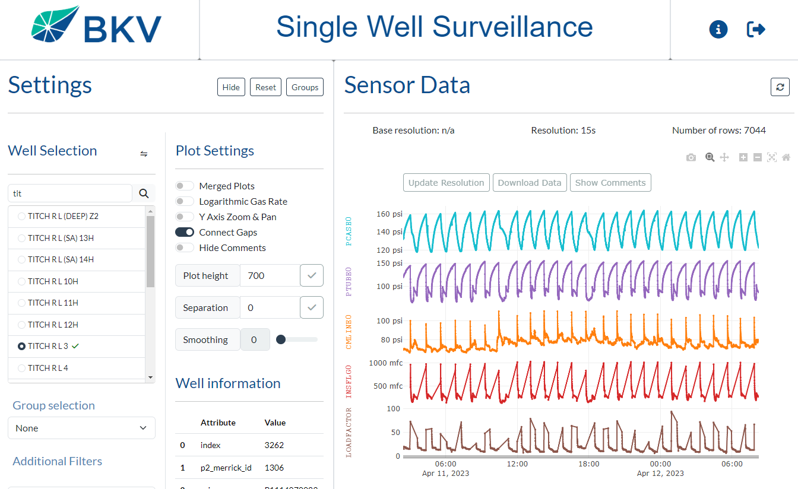

# Surveillance Dashboard - BKV Corporation

Website: [bkvcorp internal tool]  
Developer: Nestor Solalinde [(manolosolalinde@gmail.com)](mailto:manolosolalinde@gmail.com)

A set of web applications to visualize, analyze and process real time data from gas wells. Drastically improves performance over custom Power BI applications that serve similar purposes. Comprised of 3 sub applications: Single well, Multi well, Daily and Engineering Plots.

## Screenshots

#### Single Well Application

#### Daily Data Application
