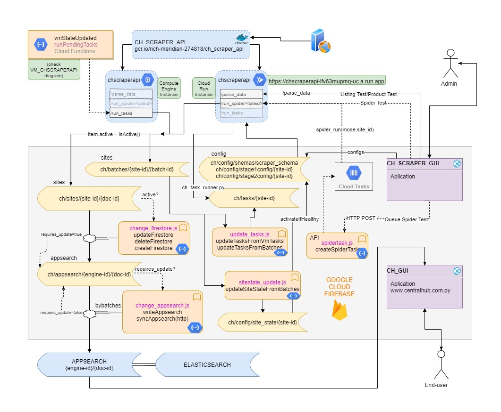
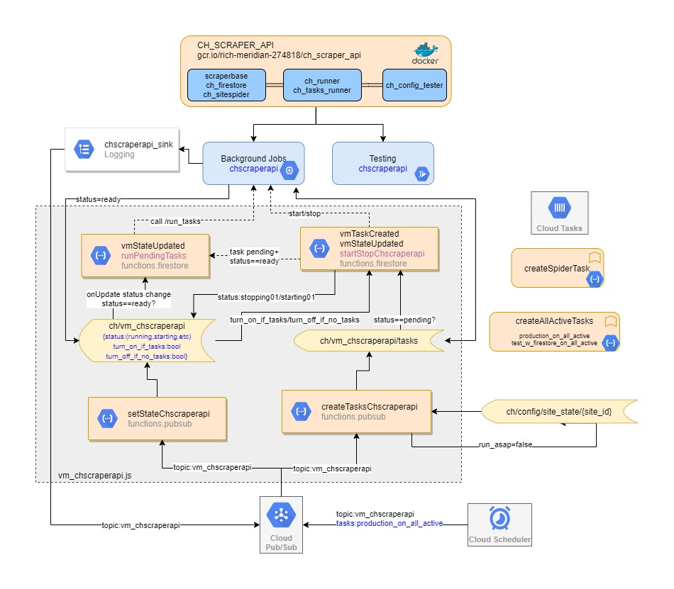

# Centralhub - E-commerce Search Engine

Developer: Nestor Solalinde [(manolosolalinde@gmail.com)](mailto:manolosolalinde@gmail.com)

A search engine platform for specialized web scraping of local e-commerce sites. 

This platform consists of 5 different sub-projects: 

1. An E-commerce Search Engine Frontend, 
    - Project Id: ch_se
    - Description: Search Engine Frontend visible to the public (the final result).
    - **Technologies**: React, Redux, Nextjs, Firebase, Git.
2. E-commerce Search Engine Admin Backend, 
    - Project Id: ch_scraper_gui
    - Project website: [https://centralhub-scrape-gui.web.app/](https://centralhub-scrape-gui.web.app/)
    - Description: Search Engine Admin Backend visible to the admin.
    - **Technologies**: Nodejs, React, Redux, Firebase, Github.
3. Web scraping API core and tools, 
    - Project Id: ch_scraper_api
    - Description: The core scraping module, used to run tests and background tasks using configuration files.
    - **Technologies**: Python, Flask, Docker, NoSQL, Firebase, Google Cloud Platform, Git.
4. Web scraping automation and synchronization tools, 
    - Project Id: ch_scraper_functions
    - Description: A set of tools to update databases, synchronize data between different services, and trigger events based on specific conditions.
    - **Technologies**: Nodejs, PubSub, Firebase Functions, Cloud Scheduler, Google Cloud Platform, Git, Task Scheduler, Compute Engine API.
5. Devops, Search Engine Implementation, Architecture, and Integrations.
    - Project Id: ch_devops
    - Description: A set of documents, scripts, and directives used to set up services, assuring that everything works as expected.
    - **Technologies**: Docker, Pytest, Jest, Firestore, Elasticsearch, Google Cloud Platform.

## How it works:

- An administrator uses the admin backend (ch_scraper_gui) to:
    - Create, modify or delete configuration files for scraping different sites.
    - Test configuration files by calling the web scraping core API tools through HTTP requests (ch_scraper_api) (running in Cloud Run)
    - Enable or disable sites for scraping
    - Schedule scraper VM instances to run in the cloud at specific schedules
    - Setup configuration parameters for scraping
    - Monitor scraping tasks on each site
- A cloud function (ch_scraper_functions) sends an API request to the web scraper (ch_scraper_api) to:
    - run a set of scripts to scrape the sites and store the results in a NoSQL database (Firestore), according to:
        - The configuration of the VM instance, such as the number of threads, schedule, etc.
        - The configuration of each site (defined in the admin backend).
- Cloud functions (ch_scraper_functions) are used to:
    - Automate the behavior of the VM instance that runs the web scraping scripts (turn on or off as required)
    - Synchronize the results of the web scraping scripts with the elasticsearch database
    - Update the current state of a specific site
    - Create scraping tasks according to configuration files

Technologies: Elasticsearch, Python, Flask, Docker, NoSQL, Scrapy, Selenium, Firebase (Functions, Firestore, Authentication, Hosting), Git, JavaScript, React, Redux, Nodejs, Google Cloud Platform (PubSub, Task Scheduler, Compute Engine API, Task Runner, Logging).
    Testing: Jest, Pytest.

## General Architecture:

<a href="./images/CH_ARCHITECTURE.jpg">

<!--  -->
</a>

## VM_CHSCRAPERAPI event triggers architecture:

<a href="./images/VM_CHSCRAPERAPI.jpg">

<!--  -->
</a>

