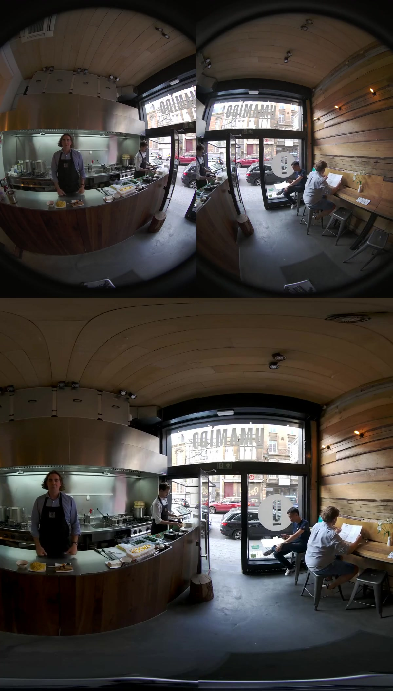

# DUAL FISHEYE TO VR180 - NVIDIA GPU VIDEO STITCHER

This tool converts dual fisheye camera videos to equirectangular stitched videos using NVIDIA CUDA, NVDEC, NVENC. 

Currently, Nvidia provides a high-level SDK for stitching multiple camera feeds (at least 4) into monoscopic and stereoscopic panoramas. However, there is no out-of-the-box support for stitching dual-camera feeds into a single panorama (VR360 only).

On top of these high-level SDKs, NVIDIA provides low-level SDKs for decoding, stitching, and encoding video streams in predefined formats. 

In this project, we take advantage of these low-level SDKs to achieve the same results as the high-level SDKs with dual cameras.

Results achieved were x100+ times faster in terms of frame rates, than the ones obtained using serial CPU programming with other stitching tools.

## Sample video (up: dual fisheye 90º yaw difference; down: 180º equirectangular projection) 

Youtube Link: [https://www.youtube.com/watch?v=gHSUaYhKRxA](https://www.youtube.com/watch?v=gHSUaYhKRxA)

 <a href="./images/cuda_stitcher.jpg">

</a>

## Output summary

```txt
GPU in use: Tesla P4
Video Input Information
        Codec        : AVC/H.264
        Frame rate   : 30000/1001 = 29.97 fps
        Sequence     : Progressive
        Coded size   : [3680, 2432]
        Chroma       : YUV 420
        Bit depth    : 8
Encoding Parameters:
        codec        : h264
        chroma       : yuv420
        bitdepth     : 8
        fps          : 30/1
        size         : 1920x1920
Full loop fps = 43.0554. input_image_buffer WxH: 3680x2428. stiched_image_buffer WxH: 1920x1920
Total frames encoded: 450
Timer summary:
     Full Loop avg = 23.1744ms
     load frames avg = 0.0280476ms
     retrieve result avg = 0.000269304ms
     stitcher avg = 1.76658ms
     timer read avg = 19.2207ms (can be greatly improved)
     write frames avg = 2.15691ms
```
## Source code fragment - Main loop

```cpp
NMSImageBuffer_t frame1,frame2,frame3; //CUDA image buffer
videoreader1.cuMemAllocate(frame1); // GPU memory allocation
videoreader1.cuMemAllocate(frame2); // GPU memory allocation
NMSVideoReader videoreader1("input_left.mp4"); //NVDEC Decoder + libav - mp4 to CUDA buffer
NMSVideoReader videoreader2("input_right.mp4");
NMSImageStitcher dual_stitcher; // CUDA Image Sticher - Dual Fisheye to Equirectangular projection (MONO_EQ VR180)
NMSVideoWriter videowriter("output.mp4", encodeCLIOptions); //NVENC Encoder - CUDA buffer to h264 to libav mp4
while (true) //loop through every frame of the input video files
{
    Timer timer_full("Full Loop");
    {
        Timer timer_read("read frames");
        bool ret1 = videoreader1.read(frame1); //write to CUDA image buffer (opencv style)
        bool ret2 = videoreader2.read(frame2);
        if (!ret1 || !ret2) break;
    }
    {
        Timer timer("load frames");
        dual_stitcher.load_dual_frames(frame1, frame2); //prepare stitcher
    }
    {
        Timer timer("stitcher");
        dual_stitcher.stitch_frames(); //GPU stitch frames
    }
    {
        Timer timer("retrieve result");
        dual_stitcher.retrieve_result(frame3); //pass result to frame3 CUDA Image Buffer as reference.
    }
    Timer timer_write("write frames");
    
    videowriter.write(frame3); //Encode result to file

}
```

## Source code fragment - CMakeLists.txt

Key library addition: `src/nmsVideo` (custom video encoder and decoder)

```cmake

cmake_minimum_required (VERSION 3.8)

set(CMAKE_CONFIGURATION_TYPES "Release;RelWithDebInfo;Debug")

project(cuda_vr180_stitcher LANGUAGES CUDA CXX)

# External Libraries

if(UNIX)
    set(CUDA_TOOLKIT_ROOT_DIR /usr/local/cuda-9.2)
    set(CMAKE_BUILD_TYPE Debug)
endif()

find_package(CUDA REQUIRED)
add_library(CUDA INTERFACE)
target_include_directories(CUDA INTERFACE ${CUDA_INCLUDE_DIRS})
target_link_libraries(CUDA INTERFACE ${CUDA_LIBRARIES} ${CUDA_CUDA_LIBRARY} 
                 ${CUDA_CUFFT_LIBRARIES} ${CUDA_CUBLAS_LIBRARIES} 
                 ${CUDA_cupti_LIBRARY} ${CUDA_curand_LIBRARY} 
                 ${CUDA_cusparse_LIBRARY} ${CUDA_npp_LIBRARY} 
                 ${CUDA_nppc_LIBRARY} ${CUDA_nppi_LIBRARY} 
                 ${CUDA_npps_LIBRARY}) #${CUDA_nvcuvenc_LIBRARY} ${CUDA_nvcuvid_LIBRARY}
    #target_link_libraries(CUDA INTERFACE ${CUDA_LIBRARIES})

find_package(OpenCV REQUIRED)
add_library(OpenCV INTERFACE)
target_link_libraries(OpenCV INTERFACE ${OpenCV_LIBS})

add_subdirectory(external)

include_directories(src/NvCodec)
include_directories(src/Utils)
include_directories(src/nmsVideo)

set(utils_SOURCES "src/Utils/ColorSpace.cu" "src/Utils/BitDepth.cu")
set(nvdecoder_SOURCES
    "src/NvCodec/NvDecoder/NvDecoder.cpp")
set(nvencoder_SOURCES
    "src/NvCodec/NvEncoder/NvEncoder.cpp"
    "src/NvCodec/NvEncoder/NvEncoderCuda.cpp")
    add_library(nmsVideo STATIC src/nmsVideo/nms_video.cpp ${utils_SOURCES} ${nvdecoder_SOURCES} ${nvencoder_SOURCES})
target_link_libraries(nmsVideo CUDA video_codec_sdk ffmpeg)
target_include_directories(nmsVideo PRIVATE ${CMAKE_CURRENT_SOURCE_DIR}/src)
message(STATUS "nmsVideo Library CMAKE_CURRENT_SOURCE_DIR: ${CMAKE_CURRENT_SOURCE_DIR}")

# Target cuda_stitcher

set(T1SOURCES 
    src/cuda_stitcher.cpp    
    )

set(target1_name cuda_stitcher)

add_executable(${target1_name} ${T1SOURCES})
target_compile_features(${target1_name} PUBLIC cxx_std_11)
target_include_directories(${target1_name} PRIVATE ${CMAKE_CURRENT_SOURCE_DIR}/src)
target_link_libraries(${target1_name} PRIVATE CUDA nmsVideo OpenCV nvss_video common_sample common_util)

# Aditional options

option(CMAKE_EXPORT_COMPILE_COMMANDS "CMAKE_EXPORT_COMPILE_COMMANDS" ON)

message(STATUS "CUDA_LIBRARIES ${CUDA_LIBRARIES}")
get_target_property(TLIBRARIES ${target1_name} LINK_LIBRARIES)
message(STATUS "${target1_name} linked libraries: ${TLIBRARIES}")
message(STATUS "${target1_name} sources: ${T1SOURCES}")

```