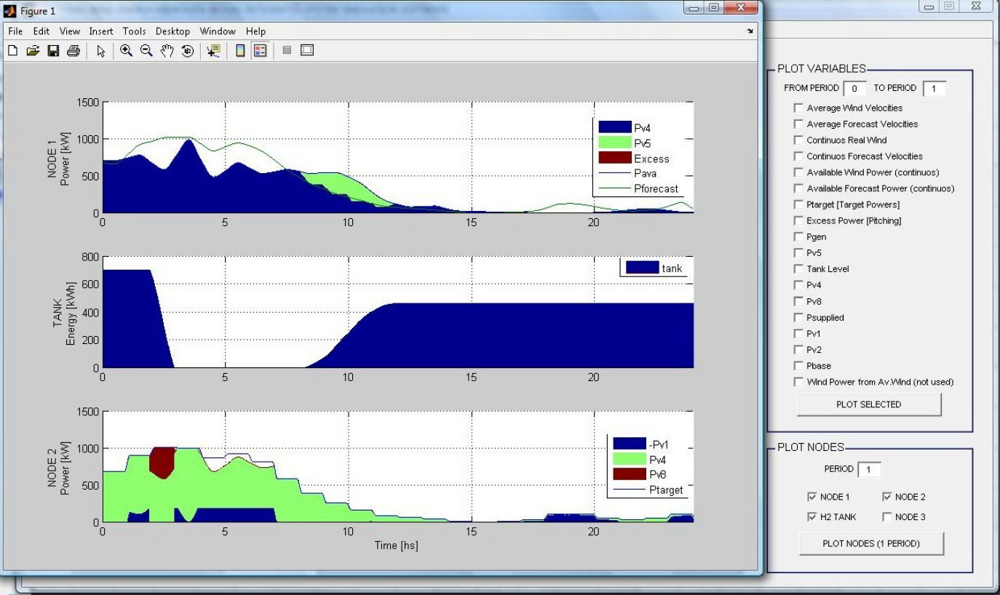
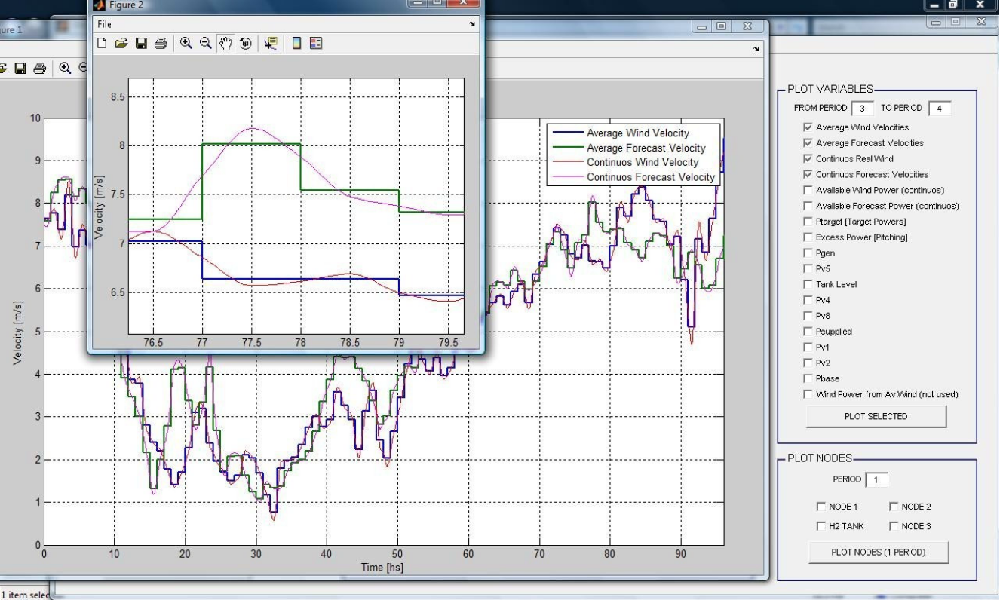
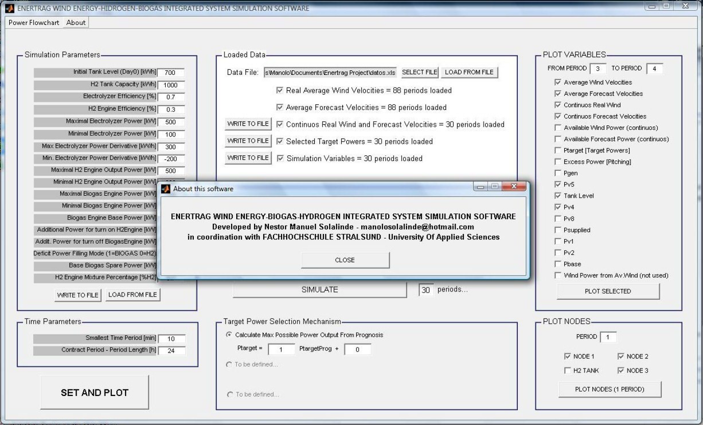
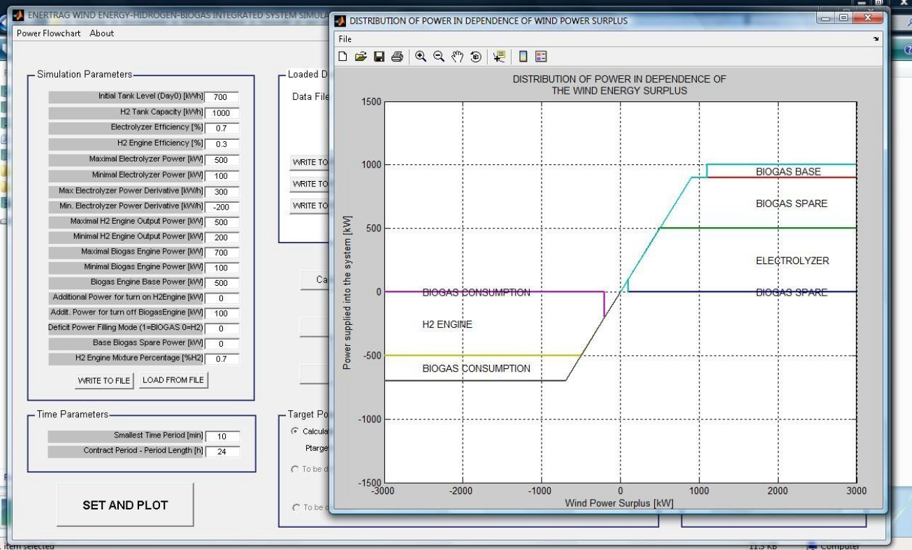
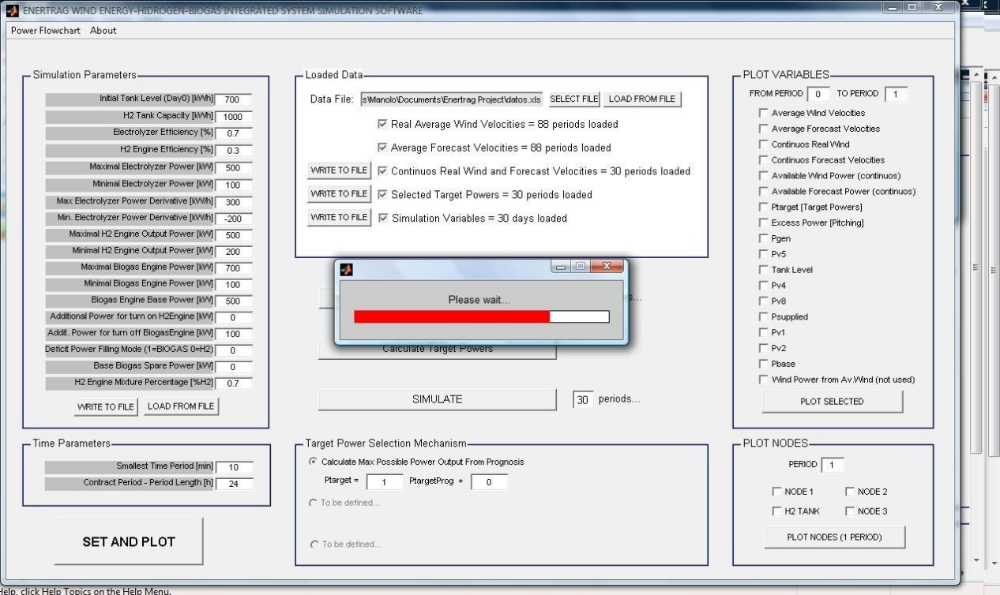

---
title: Enertrag WindEnergy-Hydrogen-Biogas Integrated System Simulation Tool
description: Developed in coordination with the Hochschule Stralsund as a base tool for simulations in the field of Wind Power-
Hydrogen integrated systems for the Enertrag company
image_url: ./images/enertrag.png
date: 2007-05-01
order: 8
local_files: `N:\COMPU VIEJA\Documentos 2009\Matemática\Optimizacion\Enertrag Project Opt`

---

# Enertrag WindEnergy-Hydrogen-Biogas Integrated System Simulation Tool

A tool for simulation of wind energy systems using hydrogen and biogas. 

Developed in coordination with the [Hochschule Stralsund](https://www.hochschule-stralsund.de/) as a base tool for simulations in the field of Wind Power-Hydrogen integrated systems for the [ENERTRAG](https://enertrag.com/) company. 

## Screenshots

 
 
 

 
 

 
 

 
 
