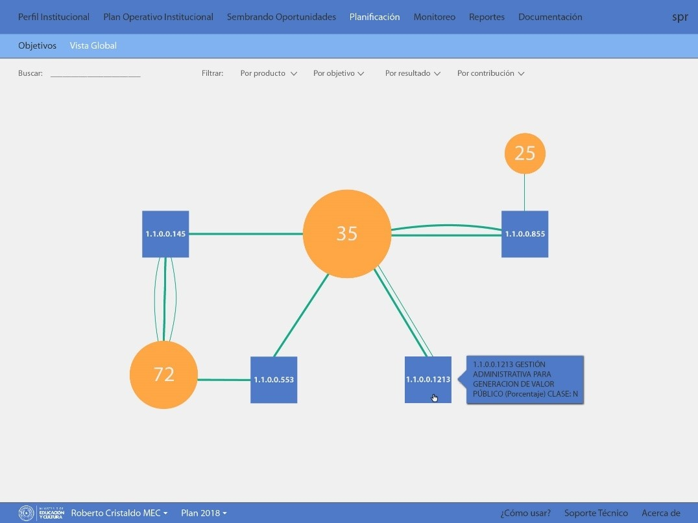
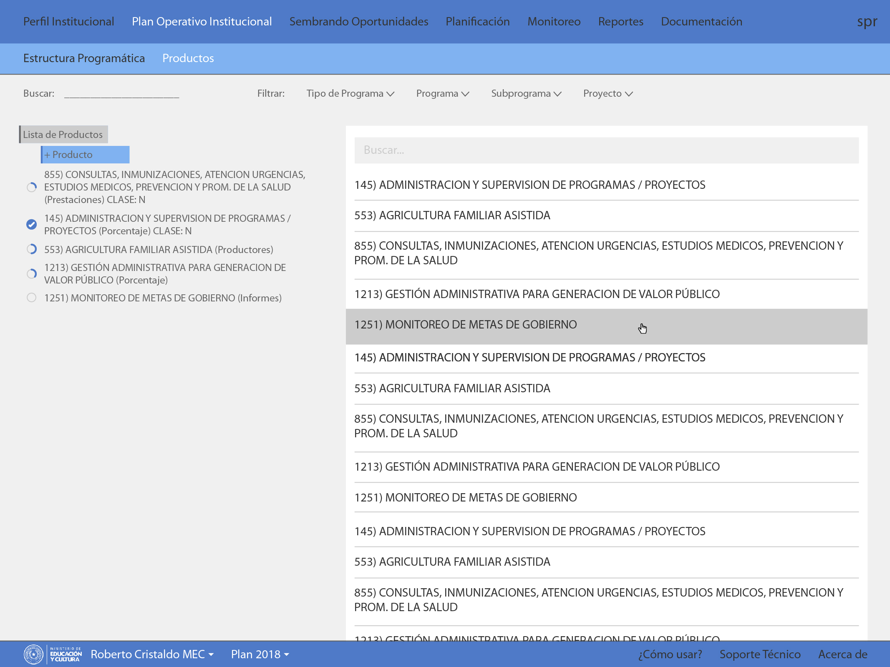

<!-- image files: E:\NMS\PROYECTOS NMS\IQSOLUTIONS\STP FAO\imagenes\PresentacionDraft02-20171220 -->

# SPR System - Technical Secretary of Planning - Paraguayan Government

Design specifications and UI/UX of the [SPR system](https://login.stp.gov.py/cas/login) of the Technical Secretary of Planning of the paraguayan government.
 - Worked in a cross-functional, agile team to rebuild the [SPR system](https://www.stp.gov.py/v1/instrumentos-spr/)
 - Assistance with information architecture and UX writing for the web app
 - _Client:_ [STP-Paraguay](https://www.stp.gov.py/v1/) 

## Screenshots

 

 